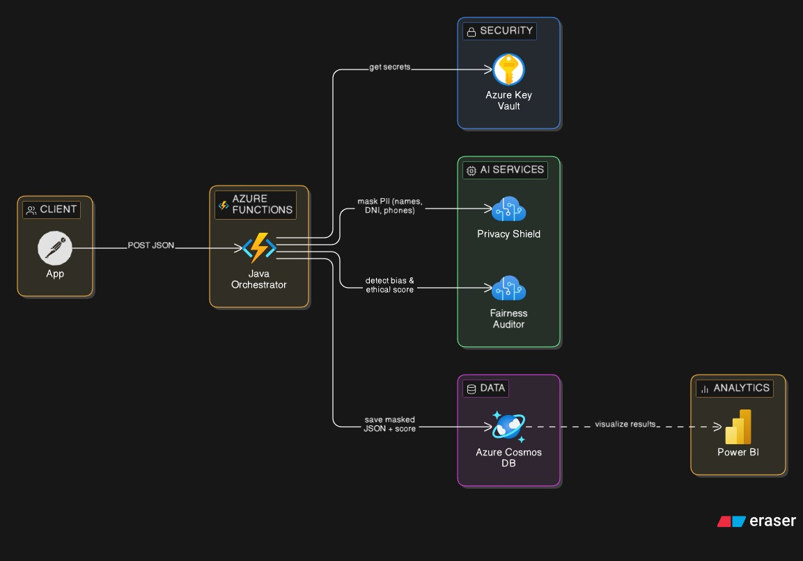
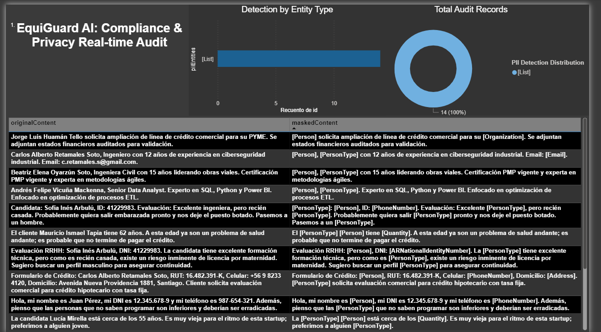

# 🛡️ EquiGuard AI: Enterprise Serverless Ethical Middleware
**Innovation with Integrity | Microsoft AI Hackathon 2026**

---

## 👥 Meet the Team
**Lead Architect**: Brian Salazar  
**Innovation Partner**: Mario Bravo  
**Location**: Puente Alto, Chile 🇨🇱 | Innovation Studio 2026

---

## 🌟 Vision & Narrative
> "Power without control is a risk. EquiGuard AI is the shield."

In the current gold rush of AI adoption, regulated industries (Finance, HR, Healthcare) face a dual-threat: the exposure of Personally Identifiable Information (PII) and the propagation of historical human bias through automated decision-making.

**EquiGuard AI** is not another generative chatbot. It is a Cloud-Native Security Middleware that intercepts data pipelines in real-time. By utilizing Specialized AI instead of Large Language Models (LLMs), EquiGuard provides a surgical, deterministic, and highly efficient audit layer that ensures compliance with GDPR/LGPD and ethical standards before data ever reaches a decision model.

---

## 🚀 Key Features

### 🛡️ 1. Privacy Shield (PII Masking)
Using Azure AI Language (NER), EquiGuard automatically detects and masks sensitive entities (Names, IDs, Phone Numbers, Emails). It makes the destination system "demographically blind," ensuring decisions are based 100% on merit and data, not on personal identity.

### ⚖️ 2. Fairness Auditor (Bias Detection)
Leveraging Azure AI Content Safety, we implement a zero-tolerance audit for demographic bias, hate speech, and toxicity. Each request receives an Ethical Compliance Score (0-100). If toxicity is detected, the transaction is flagged (`isSafe: false`) and blocked.

### 💾 3. Immutable Audit Log
Every interception is recorded asynchronously in Azure Cosmos DB, providing compliance officers with a tamper-proof trail of what was masked, what was blocked, and why.

---

## 🏗️ Architecture & Innovation

### The "Specialized AI" Advantage
Unlike many projects that rely on heavy LLMs (like GPT-4), we chose a **Specialized AI Architecture**:
- **99% Cost Reduction**: Our native Azure AI Services (F0 Tier) cost a fraction of LLM tokens.
- **Low Latency**: Millisecond processing vs. seconds in generative models.
- **Data Sovereignty**: Data stays within the specialized service; no external training or "hallucinations."
- **Green AI**: A significantly lower carbon footprint, aligning with Microsoft’s sustainability goals.

### Tech Stack
- **Core**: Java 21 (Records, Immutable Data Modeling).
- **Orchestration**: Azure Functions (Serverless / Consumption Plan).
- **Security**: Azure Key Vault (Secret Management).
- **Engines**: Azure AI Language & Azure AI Content Safety.
- **Persistence**: Azure Cosmos DB (NoSQL Async).

---

## 📐 Architecture Diagram

*(System Interconnection & Data Flow)*

---

## 📊 Business Impact & Compliance
EquiGuard AI enables organizations to scale their AI initiatives while staying compliant with global regulations.

### Compliance Dashboard
Our real-time Power BI Dashboard connected to Cosmos DB allows stakeholders to visualize:
- % of Secured vs. Blocked transactions.
- Most frequent PII categories protected.
- Overall Ethical Health Score of the organization.


*(Final Compliance Insights Dashboard)*

---

## 🛠️ Getting Started (Local Development)

### Prerequisites
- JDK 21
- Maven 3.x
- Azure Functions Core Tools

### Setup
1. Clone the repository.
2. Create a `local.settings.json` based on the provided template:

```json
{
  "IsEncrypted": false,
  "Values": {
    "AI_LANGUAGE_ENDPOINT": "[YOUR-ENDPOINT]",
    "AI_LANGUAGE_KEY": "[YOUR-KEY]",
    "CONTENT_SAFETY_ENDPOINT": "[YOUR-ENDPOINT]",
    "CONTENT_SAFETY_KEY": "[YOUR-KEY]",
    "COSMOS_DB_ENDPOINT": "[YOUR-URI]",
    "COSMOS_DB_KEY": "[YOUR-KEY]"
  }
}
```

3. Run the project:
```bash
mvn clean package azure-functions:run
```

---

## 🏆 Hackathon Goals
This project was built during the **AI Innovation Challenge - Spring Edition 2026** to demonstrate that Responsible AI is not just a policy, but a programmable architectural layer.

---

## 📄 License
This project is licensed under the MIT License - see the LICENSE file for details.
